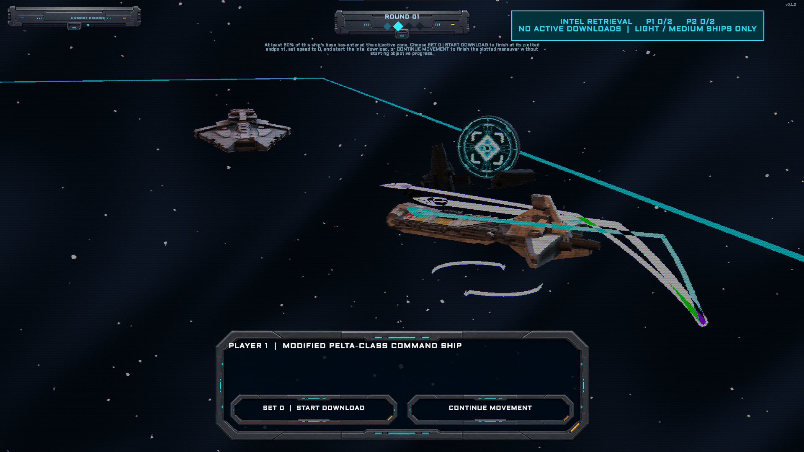
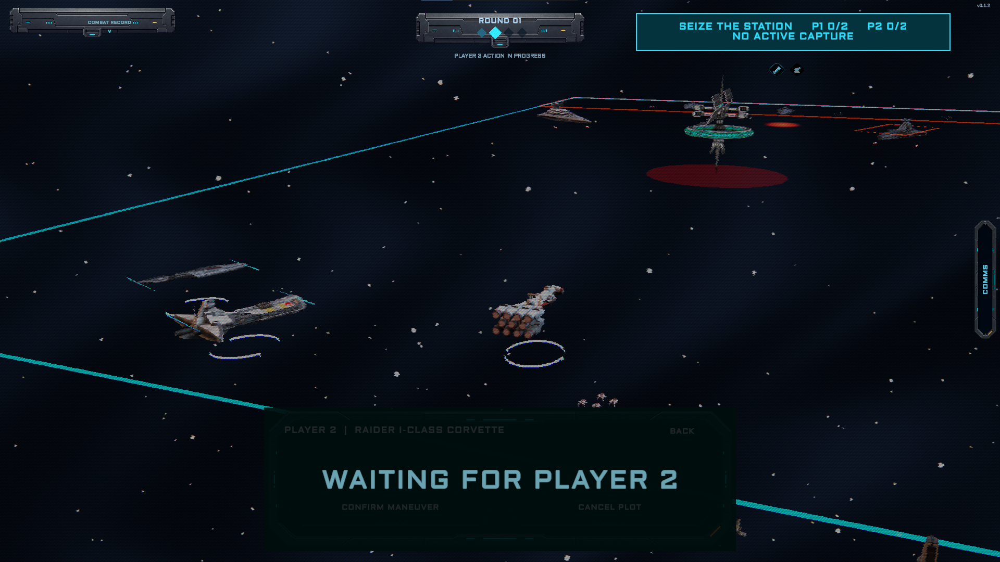
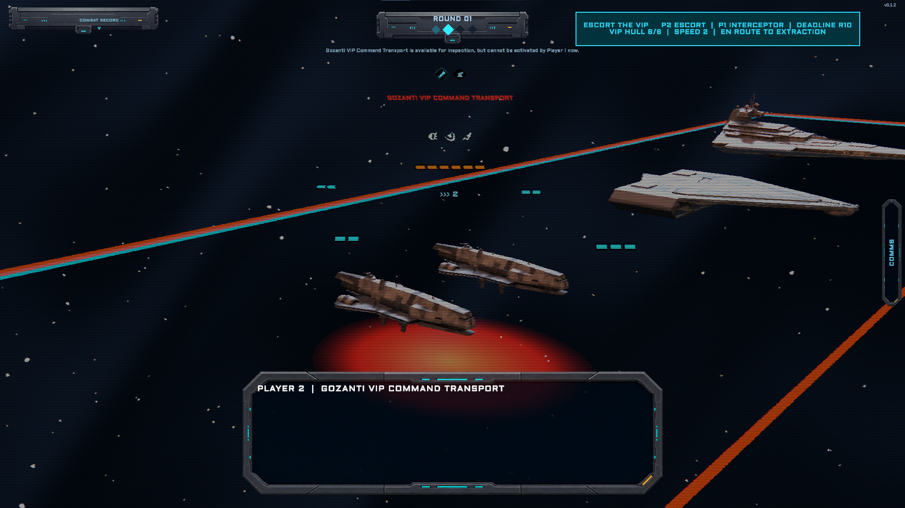
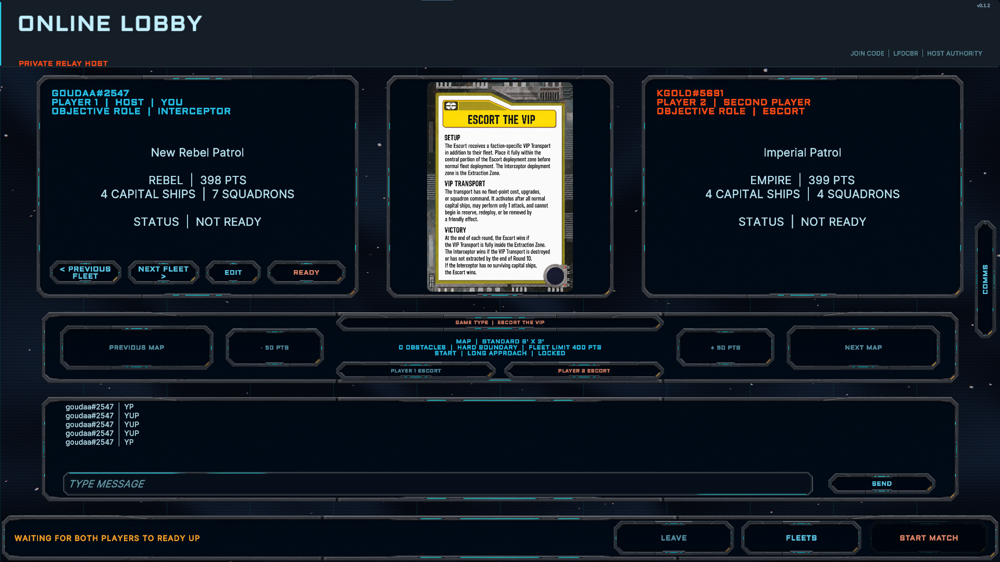

# SWArmada


**An unofficial digital adaptation of the *Star Wars: Armada* tabletop game.**

Build a custom fleet, command capital ships and squadrons, and fight tactical
battles across a fully 3D battlespace. SWArmada translates the tabletop game's
movement, firing arcs, range bands, commands, defense tokens, upgrades, and
objectives into a playable digital format wrapped in a retro tactical CRT
interface.

[Download](#download-and-install) · [Features](#features) ·
[Screenshots](#screenshots) · [Changelog](CHANGELOG.md) ·
[Project status](#project-status) ·
[Credits](#credits-and-acknowledgements)

## Screenshots

### 1. Main menu


### 2. Fleet builder


### 3. Ship browser


### 4. Squadron information


### 5. Map editor


### 6. Command dial


### 7. Tactical unit dossier


### 8. Firing arcs and range


### 9. Capital ship combat


### 10. Squadron combat


### 11. Plotting movement


### 12. Intel Retrieval



### 13. Seize the Station



### 14. Escort the VIP



### 15. Online lobby



## Features

- A fully 3D tactical battlespace for capital ships and squadrons
- Tabletop-inspired movement tools, firing arcs, and close, medium, and long
  range bands
- Attack dice, accuracy results, shields, hull damage, and defense tokens
- Command dials, ship activation, squadron activation, and round-based play
- Fleet creation and editing with ship, squadron, and upgrade libraries, plus
  text-list importing from Ryan Kingston and Star Forge formats
- Rebel Alliance, Galactic Empire, Galactic Republic, and Separatist Alliance
  fleet content
- Saved fleet archives and a fleet sandbox for testing compositions
- Single-player battles against the AI, with configurable AI fleets and
  factions
- Local hotseat play and experimental online multiplayer support with Default,
  Escort the VIP, Seize the Station, and Intel Retrieval scenarios
- An opt-in worldwide player list with locally persistent `Username#NNNN`
  handles, direct match invitations, and persistent direct comms
- Custom battlefield and map-editing tools
- Laser fire, combat effects, spatial sound, and event-driven UI audio
- A global scanline/CRT presentation inspired by retro tactical displays

## What's new in 0.2.2

- Squadron moves can no longer end with positive-area base overlap against
  another squadron or ship; bases that merely touch remain legal
- The overlap rule is enforced for player, AI, special-effect, online, and
  replay movement
- Ending squadron targeting no longer erases the active ship's shield pips or
  spatial condition display
- The condition wrench restores the active ship and remains responsive after
  those targeting transitions

See [the complete 0.2.2 release notes](https://github.com/thetrufflegouda/SWArmada/releases/tag/v0.2.2)
or browse the full [changelog](CHANGELOG.md).

## Download and install

The current public build is **SWArmada 0.2.2** for **Windows x64**,
**Linux x86-64**, **macOS Universal**, and **Android ARM64**.

1. Open the [`v0.2.2` release](https://github.com/thetrufflegouda/SWArmada/releases/tag/v0.2.2).
2. Download the archive for your platform.

### Windows x64

1. Download `SWArmada-0.2.2-Windows-x64.zip`.
2. Extract the entire ZIP to a writable folder.
3. Run `SWArmada.exe`.

Keep `SWArmada.exe` beside `SWArmada_Data`, `UnityPlayer.dll`, and the other
packaged files. Windows may show a security prompt because this early build is
not code-signed.

### Linux x86-64

1. Download `SWArmada-0.2.2-Linux-x86_64.tar.gz`.
2. Extract the entire archive.
3. Run `./SWArmada.x86_64` from the extracted folder.

The executable permission is stored in the archive. If your extraction tool
does not preserve it, run `chmod +x SWArmada.x86_64` first.

### macOS Universal

1. Download `SWArmada-0.2.2-macOS.tar.gz`.
2. Extract the entire archive.
3. Open `SWArmada.app`.

The app supports both Intel and Apple Silicon Macs. This early build is not
Apple-notarized, so macOS may require you to right-click the app and select
Open, or approve it under Privacy & Security, on first launch.

### Android ARM64

1. Download `SWArmada-0.2.2-Android-arm64.apk` on an ARM64 device running
   Android 8.0 / API 26 or newer.
2. Allow your browser or file manager to install unknown apps when prompted.
3. Open the APK and install SWArmada.

This is a sideload/test-signed APK rather than a Google Play release. Android
uses the device's native landscape resolution and exposes only the frame-rate
limit in display settings.
### Verify the download

SHA-256 checksums:

```text
EB06B3F8751D8DB11B02EB2566F13619668C6D1D976647310A8B9F4CF21CDA5A  SWArmada-0.2.2-Windows-x64.zip
9B2C9EBE4D37F76561A6CF1FE8B1C6983AD597C1607B07845E86810AC30AA7CD  SWArmada-0.2.2-Linux-x86_64.tar.gz
E23F29644B148A2CFB9C8CB3CFFC6651550ECE69BE441E3D2F3BDC5DE4D6B696  SWArmada-0.2.2-macOS.tar.gz
171B9567E4F4E494DA9032ED3FD224B282E446C6DDA11A2D2ED77A67C6A398F7  SWArmada-0.2.2-Android-arm64.apk
```

In PowerShell, compare it with:

```powershell
Get-FileHash .\SWArmada-0.2.2-Windows-x64.zip -Algorithm SHA256
```

On Linux, compare it with:

```bash
sha256sum SWArmada-0.2.2-Linux-x86_64.tar.gz
```

## How it plays

Start by creating a fleet from the available ships, squadrons, upgrades, and
objectives. During battle, deploy your forces, reveal commands, maneuver ships
with the navigation tool, activate squadrons, and resolve attacks through the
appropriate firing arc and range band. Unit dossiers keep the selected ship or
squadron's condition, speed, shields, firepower, and abilities visible while
you make decisions.

SWArmada aims to preserve the deliberate, measurement-driven character of the
tabletop game while letting the computer handle scene presentation, state
tracking, and online synchronization.

## Project status

Version `0.2.2` is the current public build. It is an early build, not a
finished commercial release. Features, rules behavior, balance, presentation,
saved data, and multiplayer compatibility may change as the game develops.
Bugs and incomplete content should be expected.

This repository is the public release home for SWArmada. It contains project
information, the full [changelog](CHANGELOG.md), and release metadata;
downloadable Windows, Linux, macOS, and Android builds are attached to GitHub
Releases.

## Feedback and bug reports

When the repository is live, use
[GitHub Issues](https://github.com/thetrufflegouda/SWArmada/issues) for a bug
report or feature request. Include the game version, what you were doing, what
you expected, and what happened. Screenshots are especially useful for visual
or gameplay-state problems.

## Credits and acknowledgements

### Project

- **Design and development:** [thetrufflegouda](https://github.com/thetrufflegouda)
- **Engine:** [Unity](https://unity.com/) with the Universal Render Pipeline,
  Input System, Netcode for GameObjects, and Unity Multiplayer Services

### Visuals and interface

- **Retro Shaders Pro for URP:** Daniel Ilett — used for the global CRT and
  retro display treatment
- **Aldrich:** Matthew Desmond / MADType — SIL Open Font License 1.1
- **Inter:** The Inter Project Authors — SIL Open Font License 1.1

### Game data, models, and source references

- **Star Forge:** [Polkadoty's Armada fleet builder](https://star-forge.tools/)
  and its public data were used as a reference for official fleet content
- **Tabletop Simulator Armada source material:**
  [Valadian / Jesse Berger's TabletopSimulatorIncludeDir](https://github.com/Valadian/TabletopSimulatorIncludeDir)
  was used as a source reference for portions of the model and texture library

Thank you to the *Star Wars: Armada* community, tool creators, mod authors,
playtesters, and everyone preserving and expanding the tabletop game.

More detailed attribution and licensing notes are available in
[THIRD_PARTY_NOTICES.md](THIRD_PARTY_NOTICES.md). If a credit is incomplete or
incorrect, please open an issue so it can be corrected.

## Disclaimer

SWArmada is an unofficial, non-commercial fan project. It is not affiliated
with, authorized by, sponsored by, or endorsed by Lucasfilm Ltd., The Walt
Disney Company, Fantasy Flight Games, Atomic Mass Games, or any other rights
holder named here.

*Star Wars* and related names, characters, artwork, and designs are the
property of their respective owners. *Star Wars: Armada* was created and
published by Fantasy Flight Games, with stewardship later moving to Atomic
Mass Games. Third-party names are used only for identification and
acknowledgement; attribution does not imply endorsement or permission.
