# SWArmada


**An unofficial digital adaptation of the *Star Wars: Armada* tabletop game.**

Build a custom fleet, command capital ships and squadrons, and fight tactical
battles across a fully 3D battlespace. SWArmada translates the tabletop game's
movement, firing arcs, range bands, commands, defense tokens, upgrades, and
objectives into a playable digital format wrapped in a retro tactical CRT
interface.

[Download](#download-and-install) · [Features](#features) ·
[Screenshots](#screenshots) · [Project status](#project-status) ·
[Credits](#credits-and-acknowledgements)

## Screenshots

<!--
Screenshots are intentionally ordered by filename: 1-9, then 91 and 92.
To replace one later, upload a new PNG with the same filename under
media/screenshots and GitHub will update this page automatically.
-->

### 1. Main menu

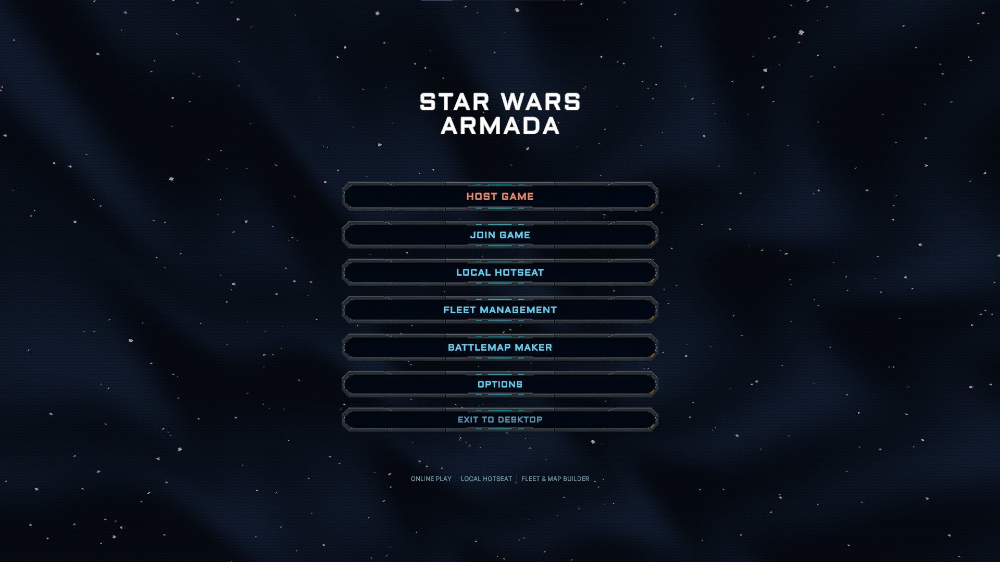

### 2. Fleet builder

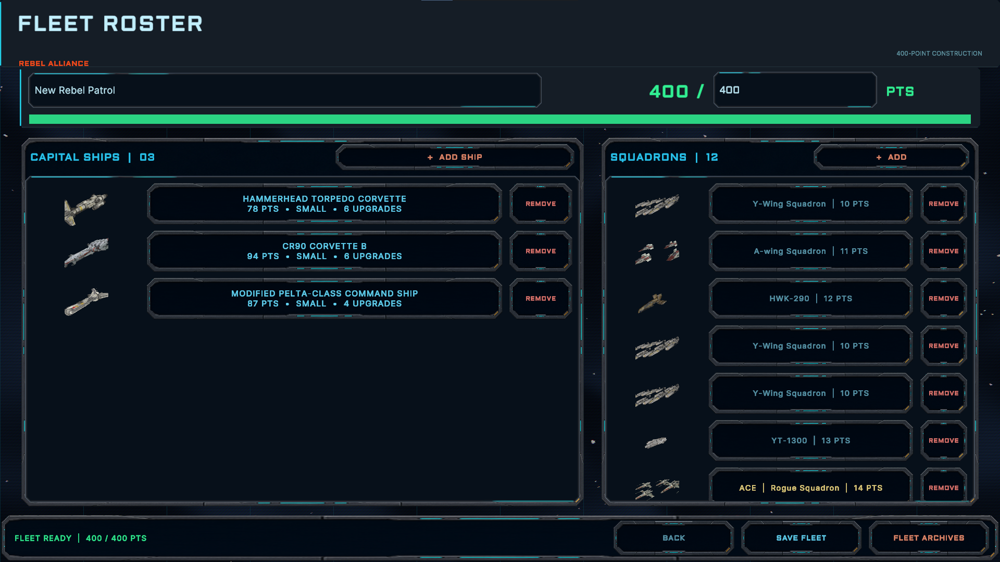

### 3. Ship browser

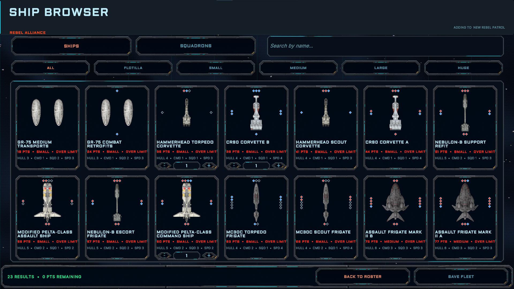

### 4. Squadron information

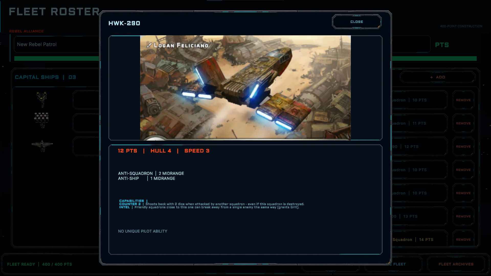

### 5. Map editor

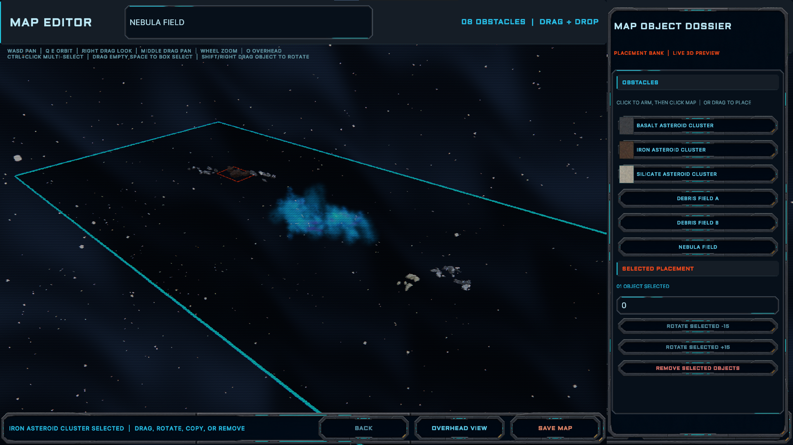

### 6. Command dial

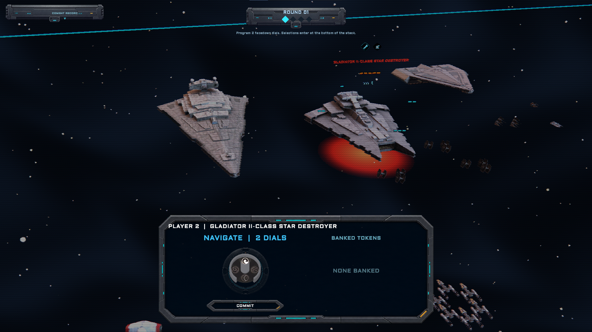

### 7. Tactical unit dossier

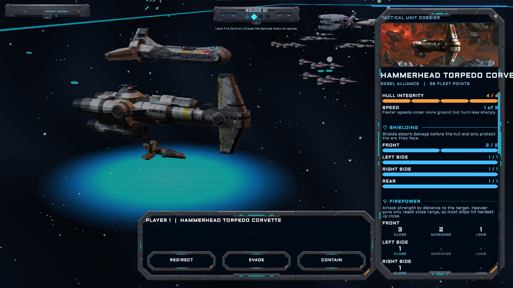

### 8. Firing arcs and range

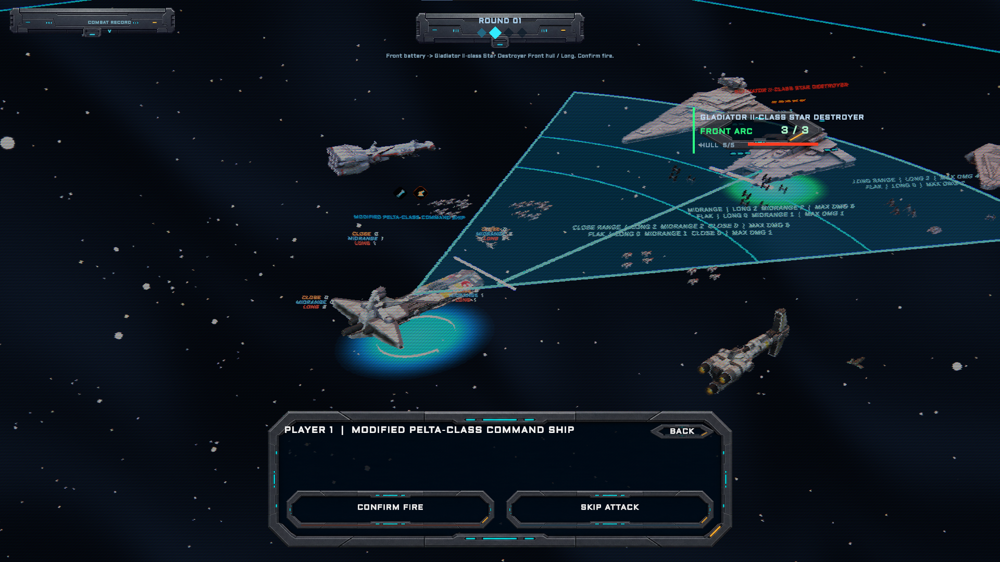

### 9. Capital ship combat

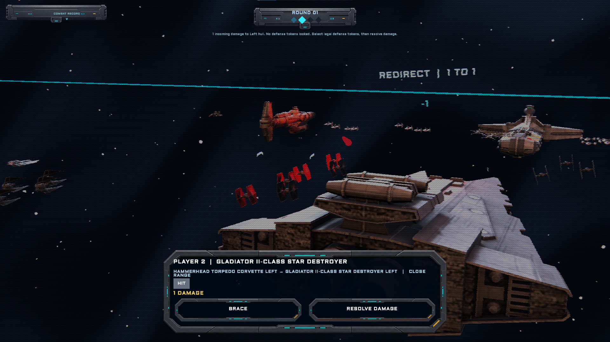

### 10. Squadron combat

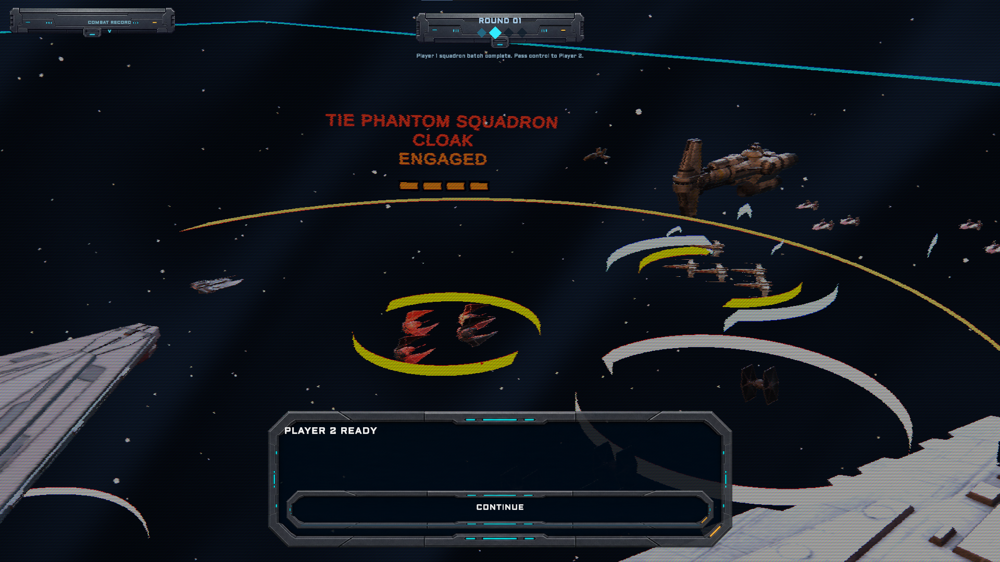

### 11. Plotting movement

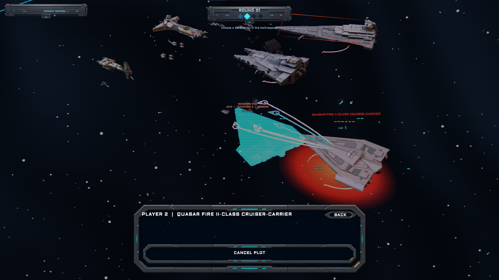

## Features

- A fully 3D tactical battlespace for capital ships and squadrons
- Tabletop-inspired movement tools, firing arcs, and close, medium, and long
  range bands
- Attack dice, accuracy results, shields, hull damage, and defense tokens
- Command dials, ship activation, squadron activation, and round-based play
- Fleet creation and editing with ship, squadron, upgrade, and objective
  libraries
- Saved fleet archives and a fleet sandbox for testing compositions
- Local hotseat play and experimental online multiplayer support
- Custom battlefield and map-editing tools
- Laser fire, combat effects, spatial sound, and event-driven UI audio
- A global scanline/CRT presentation inspired by retro tactical displays

## Download and install

The first public baseline is **SWArmada 0.1.0** for **Windows x64**.

1. Open the [`v0.1.0` release](https://github.com/thetrufflegouda/SWArmada/releases/tag/v0.1.0).
2. Download `SWArmada-0.1.0-Windows-x64.zip`.
3. Extract the entire ZIP to a writable folder.
4. Run `SWArmada.exe`.

Keep `SWArmada.exe` beside `SWArmada_Data`, `UnityPlayer.dll`, and the other
packaged files. Windows may show a security prompt because this early build is
not code-signed.

### Verify the download

SHA-256:

```text
F9A2E9E2201B35FE8EBBEE4EB9C7CCFF6E2F8EF132EDB527710DDD006834A6A8
```

In PowerShell, compare it with:

```powershell
Get-FileHash .\SWArmada-0.1.0-Windows-x64.zip -Algorithm SHA256
```

## How it plays

Start by creating a fleet from the available ships, squadrons, upgrades, and
objectives. During battle, deploy your forces, reveal commands, maneuver ships
with the navigation tool, activate squadrons, and resolve attacks through the
appropriate firing arc and range band. Unit dossiers keep the selected ship or
squadron's condition, speed, shields, firepower, and abilities visible while
you make decisions.

SWArmada aims to preserve the deliberate, measurement-driven character of the
tabletop game while letting the computer handle scene presentation, state
tracking, and online synchronization.

## Project status

Version `0.1.0` is the project's first public baseline. It is an early build,
not a finished commercial release. Features, rules behavior, balance,
presentation, saved data, and multiplayer compatibility may change as the game
develops. Bugs and incomplete content should be expected.

This repository is the public release home for SWArmada. It contains project
information and release metadata; downloadable Windows builds are attached to
GitHub Releases.

## Feedback and bug reports

When the repository is live, use
[GitHub Issues](https://github.com/thetrufflegouda/SWArmada/issues) for a bug
report or feature request. Include the game version, what you were doing, what
you expected, and what happened. Screenshots are especially useful for visual
or gameplay-state problems.

## Credits and acknowledgements

### Project

- **Design and development:** [thetrufflegouda](https://github.com/thetrufflegouda)
- **Engine:** [Unity](https://unity.com/) with the Universal Render Pipeline,
  Input System, Netcode for GameObjects, and Unity Multiplayer Services

### Visuals and interface

- **Retro Shaders Pro for URP:** Daniel Ilett — used for the global CRT and
  retro display treatment
- **Aldrich:** Matthew Desmond / MADType — SIL Open Font License 1.1
- **Inter:** The Inter Project Authors — SIL Open Font License 1.1

### Game data, models, and source references

- **Star Forge:** [Polkadoty's Armada fleet builder](https://star-forge.tools/)
  and its public data were used as a reference for official fleet content
- **Tabletop Simulator Armada source material:**
  [Valadian / Jesse Berger's TabletopSimulatorIncludeDir](https://github.com/Valadian/TabletopSimulatorIncludeDir)
  was used as a source reference for portions of the model and texture library

Thank you to the *Star Wars: Armada* community, tool creators, mod authors,
playtesters, and everyone preserving and expanding the tabletop game.

More detailed attribution and licensing notes are available in
[THIRD_PARTY_NOTICES.md](THIRD_PARTY_NOTICES.md). If a credit is incomplete or
incorrect, please open an issue so it can be corrected.

## Disclaimer

SWArmada is an unofficial, non-commercial fan project. It is not affiliated
with, authorized by, sponsored by, or endorsed by Lucasfilm Ltd., The Walt
Disney Company, Fantasy Flight Games, Atomic Mass Games, or any other rights
holder named here.

*Star Wars* and related names, characters, artwork, and designs are the
property of their respective owners. *Star Wars: Armada* was created and
published by Fantasy Flight Games, with stewardship later moving to Atomic
Mass Games. Third-party names are used only for identification and
acknowledgement; attribution does not imply endorsement or permission.
